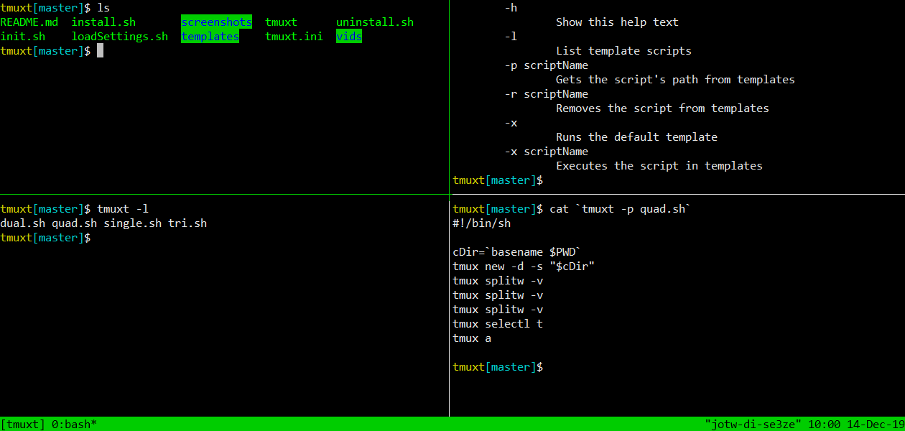

# tmuxt

<div align="center">
  <a href="screenshots/tmuxt.png">
    
  </a>
</div>

tmuxt (Tmux Templates) is a simple script manager for tmux that provides options for 
managing scripts (e.g., add, edit, etc.) added to the tmuxt [templates](templates) directory.

Scripts are used as templates to create pre-defined tmuxt screens (e.g., panes, windows, etc.).

**Features**:
- Easy install/uninstall
- List templates
- Pre-defined templates
- Quickly run a template by setting a default template
- Add custom templates
- Execute templates
- Reference templates by path
- Edit templates
- Remove templates

## Demo

Video demonstration available at [YouTube](https://www.youtube.com/watch?v=J2Cz5T2N8tU).

## Dependencies

- **bash** for tmuxt and associated files
- **tmux** for tmuxt's pre-defined [templates](templates)

tmuxt was created to manage scripts containing tmux commands but can be used to manage any bash scripts, however, the pre-defined [templates](templates) provided by tmuxt contain tmux commands that depend on on tmux.

## Install

Download and run the install script:
```bash
cd ~
git clone https://github.com/surajs02/tmuxt.git
cd tmuxt
. install.sh
```

## Uninstall

tmuxt is portable (all setup is done via `~/.bashrc`) so is easily removed by running the uninstall script:
```bash
. uninstall.sh
```

## Usage

`tmuxt [-dhlx | -a scriptPath | -derx scriptName]`

Show help:
```bash
tmuxt -h
```

Add script to templates:
```bash
tmuxt -a ./script.sh
```

List templates:
```bash
tmuxt -l
```

Set template as default:
```bash
tmuxt -d script.sh
```

Show current default template:
```bash
tmuxt -d
```

Execute template:
```
tmuxt -x script.sh
```

Execute default template:
```
tmuxt -x
```

Edit template (uses default editor via `$EDITOR`):
```bash
tmuxt -e script.sh
```

Remove template:
```bash
tmuxt -r script.sh
```

## Future plans

- Replace `getopts` with custom options handling (e.g., optional option arguments)
- Add current directory autocomplete for add option (currently autocomplete lists template directory contents)
- Add man page